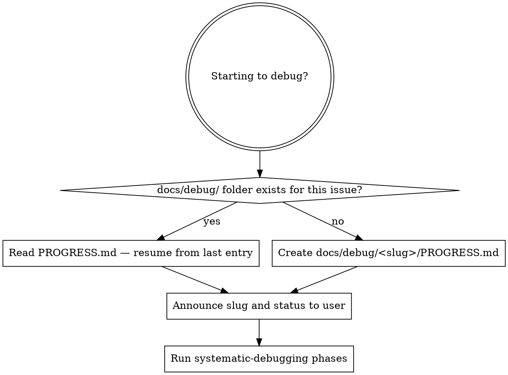

# Debugging Edzio

## Overview

This skill wraps `superpowers:systematic-debugging` with a **persistent PROGRESS.md** stored at `docs/debug/<slug>/PROGRESS.md`. Every investigation has one. New agent sessions read it to resume; completed sessions update it. The file is never committed.

**Do not propose fixes before completing Phase 1 of systematic-debugging.**

## Step 0 — Before Anything Else: Set Up the Progress Document

Run this before any code reading, log reading, or hypothesis forming.



### Slug naming

Derive from the symptom — short, lowercase, hyphenated, no dates:
- `webrtc-answerer-channel-hang`
- `transfer-stalls-at-manifest`
- `signaling-reconnect-drops-candidates`

Check `docs/debug/` first; if a folder already exists for the same symptom, reuse it.

### Creating the file

```
docs/debug/<slug>/PROGRESS.md
```

Use the template below. Fill in what you already know from the user's description.

## PROGRESS.md Template

```markdown
# Debug: <Human-Readable Issue Title>

**Slug:** <slug>
**Status:** Active
**Opened:** <YYYY-MM-DD>
**Resolved:** —

## Problem Statement

<One paragraph: what symptom was observed, under what conditions, how to reproduce.>

## Log / Artifact Locations

<Paths to any log files, crash dumps, or other evidence provided by the user.>

## Evidence Gathered

- [ ] Logs read
- [ ] Relevant source files identified
- [ ] Transfer timeline reconstructed

## Theories

| # | Theory | Status | Supporting evidence | Refuting evidence |
|---|--------|--------|---------------------|-------------------|
| 1 | <first hypothesis> | Pending | — | — |

Theory status values: `Pending` · `Confirmed` · `Refuted`

## Investigation Log

### <YYYY-MM-DD> — Session 1

**What was done:**
<Bullet list of steps taken this session.>

**What was found:**
<Key observations, exact log lines, code line references.>

**Open questions:**
<What still needs to be answered.>

## Root Cause

*(Fill in when confirmed.)*

## Fix Applied

*(Fill in when resolved — file, line numbers, description of the change.)*
```

## Edzio Log Files

**Always read the logs before forming any theory.** The app writes a detailed rolling log to:

```
%LOCALAPPDATA%\Edzio\logs\edzio-YYYY-MM-DD.log
```

The log captures every step of the WebRTC handshake, ICE candidate exchange, signaling events, and state transitions. SIPSorcery's own internal logs (ICE connectivity checks, DTLS, SCTP) also go there via `SIPSorcery.LogFactory`.

When debugging a P2P connection issue, open the log on **both** machines and check in this order:

1. Last `[Offerer]` and `[Answerer]` lines — tell you exactly which step hung
2. Whether ICE candidates were gathered (`Local ICE candidate #N: ...`)
3. Whether candidates were exchanged (`← IceCandidateReceived`, `→ SendIceCandidate`)
4. ICE connection state sequence: `new → checking → connected` (stuck at `checking` = firewall/NAT issue)
5. Whether `Data channel OPEN` appears on **both** sides (missing on the answerer = the `ondatachannel`/`onopen` race)

To add new log points anywhere in the Desktop project without DI, use the `EdzioLog` static class:

```csharp
// src/Edzio.Desktop/Services/EdzioLog.cs
EdzioLog.Info("Component", "message");
```

Record the log file paths in the **Log / Artifact Locations** section of the PROGRESS.md at the start of every investigation.

## Step 1–4 — Run systematic-debugging

**REQUIRED:** Load and follow `superpowers:systematic-debugging` for all four phases (Root Cause → Pattern → Hypothesis → Implementation).

After each significant finding, **update the PROGRESS.md**:
- Check off evidence items as gathered
- Add a new row to the Theories table with its current status
- Append a new entry to the Investigation Log

The file must always reflect the current state so a new agent session can pick up without re-reading logs or re-examining code.

## Updating Theories

When you form or test a hypothesis, add or update its row immediately:

| Status | When to use |
|--------|-------------|
| `Pending` | Theory formed, not yet tested |
| `Confirmed` | Evidence confirms this is the root cause |
| `Refuted` | Evidence rules it out — document WHY so it is not re-examined |

Never delete a refuted theory. Future sessions need to know it was already checked.

## Resolving the Issue

The issue is resolved when the user says any of:
- "issue solved" / "issue fixed"
- "problem solved" / "problem fixed"

When that happens, update the PROGRESS.md:

1. Set `**Status:** Resolved`
2. Set `**Resolved:** <today's date>`
3. Fill in **Root Cause** with the confirmed explanation
4. Fill in **Fix Applied** with file path(s), line numbers, and a one-sentence description of the change
5. Mark all confirmed theories as `Confirmed` and all remaining as `Refuted`

Do not delete `docs/debug/<slug>/` — the file is gitignored and acts as a local audit trail.

## Resuming in a New Session

When a user mentions a bug and `docs/debug/` already contains a matching folder:

1. Read `PROGRESS.md`
2. Report to the user: current status, last log entry date, open questions, and pending theories
3. Continue from where the previous session left off — do not repeat already-verified theories
4. Start a new Investigation Log entry for the new session date

## What NOT to Do

- Do not start investigating before creating or reading the PROGRESS.md
- Do not re-examine a theory already marked `Refuted`
- Do not mark the issue resolved until the user says one of the resolution phrases
- Do not commit `docs/debug/` — it is in `.gitignore`
- Do not add PROGRESS.md entries speculatively; only record what was actually done
